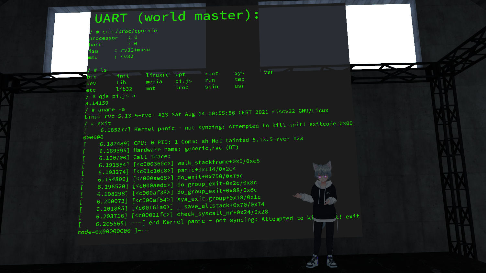

# rvc - risc v in c / HLSL

An experimental 32-bit [0] RISC-V emulator written in plain C [1], with a focus on porting the result to a HLSL pixel shader.

The resulting HLSL (Unity CG) can be found in `_Nix/`, read on to learn more.

A version of this shader running in VRChat can be found in this world:  
https://vrchat.com/home/world/wrld_8126d9ef-eba5-4d49-9867-9e3c4f0b290d

The C version was initially based on [takahirox/riscv-rust](https://github.com/takahirox/riscv-rust) (see for example instruction decoder generation using `instructions.txt` and `parse_ins.pl`), which is a great resource for learning about RISC-V in general, aside from the [official specs](https://riscv.org/technical/specifications/) of course.

[0] GPUs only really support 32-bit integer math (in the use-case I want to put this in anyway)  
[1] The elf loader ('elfy') is written in Rust, because I was too lazy to do it myself in C (Rust uses the 'elf' crate) and it doesn't need porting anyway.

# Cloning this repository

This repo makes heavy use of submodules, so make sure to use `git clone --recursive` on initial cloning (may take a long time) and run `git submodule update --recursive` after a new pull.

To build any of the code included, you will probably need the following:
* A C compiler (gcc, clang)
* A rust compiler
* Perl 5
* A device tree compiler (dtc)

# C version specifics

Pay no mind to the somewhat weird style of C please, it is mostly because of the need to port to HLSL.

To build, remove the 'rvc' binary and 'src/main.o', then run 'make rvc' from the top level directory.

To run the riscv-tests, use `test.sh`. `test.sh all --clean` can be used to run the full supported test suite.

# Shader specifics

The shader version is a direct port of the C one. It can be found as part of a Unity project in `_Nix/`.

This is *not* a drag-and-drop prefab by any means, it will require careful setup and integration into a world to be useful.

The biggest pitfall is probably the required Perl support. The shader code uses [perlpp](https://github.com/interpreters/perlpp) and a valid runtime environment (I recommend [Strawberry Perl](https://strawberryperl.com/) for Windows). See the file `AutoImport.cs` for more information, you will need to set a valid path in there. Technically, the already created \*.h files can be used as-is, but you won't be able to meaningfully change any code without it.

The approach uses a Custom Render Texture and some (really messy) VRChat Udon scripts to manage the emulator during runtime. They will probably require fixing up for use in your own world.

The `NixDebug.cs` (Udon) script needs to be placed on a camera pointing at a camera loop reading in from the 'display' shader. This provides a translation layer between the 128bit-per-pixel integer texture used in the CRT and the `Color(float, float, float, float)` struct available in Unity/C#.

`NixControl.cs` is built with support for my [Dial](https://github.com/PiMaker/VRChatUnityThings#dial) prefab in mind, but can be changed to support any other control input too of course.

# Build instructions (for the various subprojects/payloads)

### Toolchain/Initramfs

For both the target toolchain (`riscv32-gnu-linux-`) and the initramfs, [buildroot](https://buildroot.org/) is used - this is *not* a submodule, but an extracted and slightly modified version instead.

To build, run `make buildroot-2021.05/build.marker` in the top level directory. The toolchain will be made in `buildroot-2021.05/output/host` and the rootfs in `buildroot-2021.05/output/images`. This will take a long time.

### Micropython

Enter the 'mprv' subdirectory. Run 'make'. Requires the toolchain to be built.

### bare_metal_test

Enter the 'bare_metal_test' subdirectory. Run 'make'. Requires the toolchain to be built.

### toimg

This tool is responsible for converting binary images (not ELF!) into texture files you can import into Unity, which can then be run by the shader version.

Enter the 'toimg' subdirectory. Run `cargo build --release`. Use `./target/release/toimg <binary> 2048 2048` to create an image file. The second '2048' specifies the height, which may be smaller than '2048'. On the first run, the program will display the optimal size to give for running a second time. This is not necessary, but will produce smaller images.

### rust_payload

This is a test payload written in rust. It demonstrates the ability to run rust code natively on the emulator (both C and shader version). Build by running `make rust_payload.bin` in the top-level directory.

NOTE: This requires a custom rust toolchain, as the default one does not have a 'rv32ima' target, only 'rv32imac' which is not supported. A demonstrative patch for [rustc](https://github.com/rust-lang/rust) can be found in `rust-target-rv32ima.patch`.

### linux

To build the linux payload, run `make linux_payload.bin` in the top level directory. This requires the toolchain and initramfs to be built.

# Why?

Because.

# License

MIT. See LICENSE for more.
